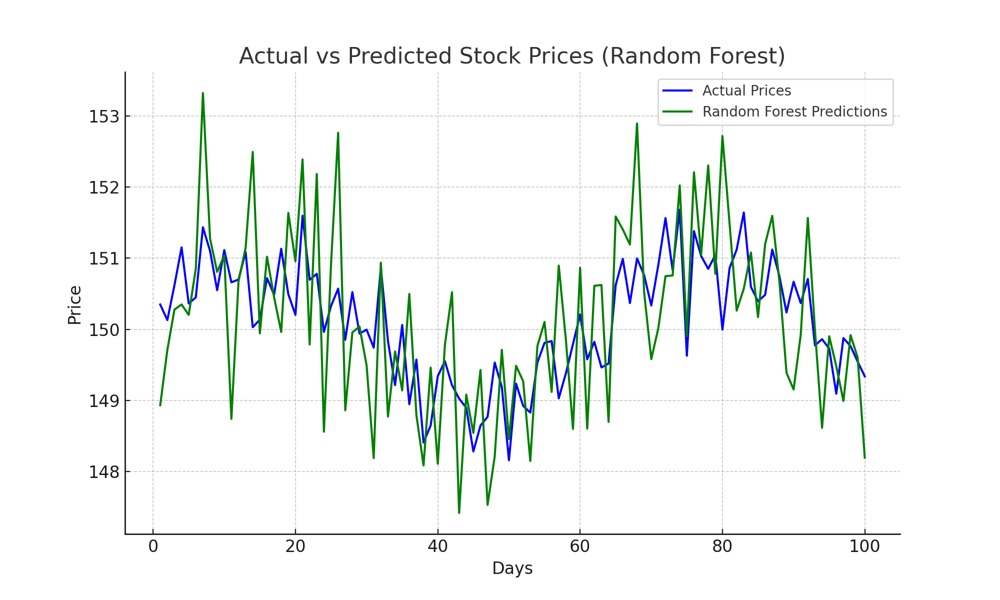
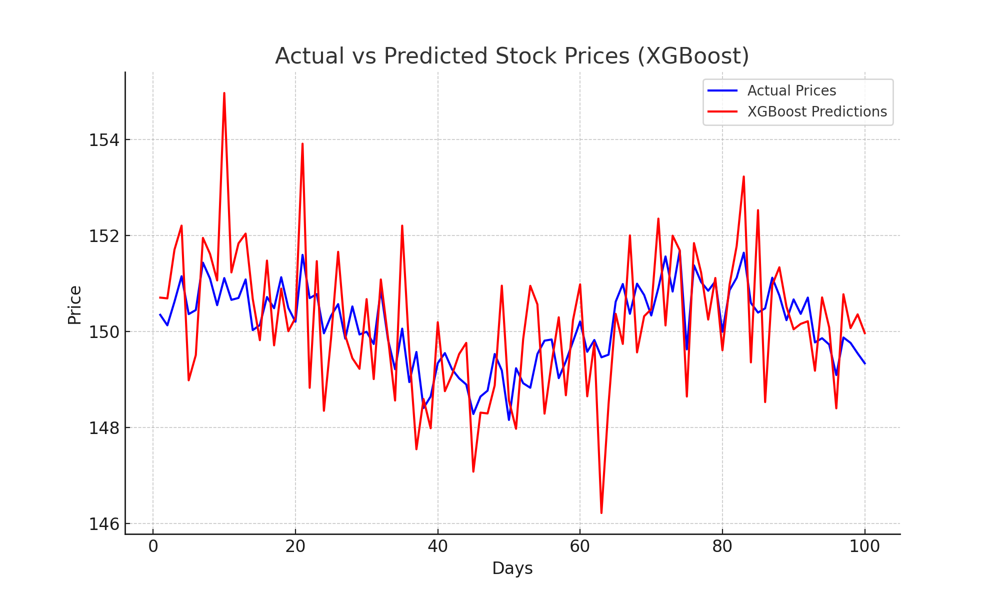
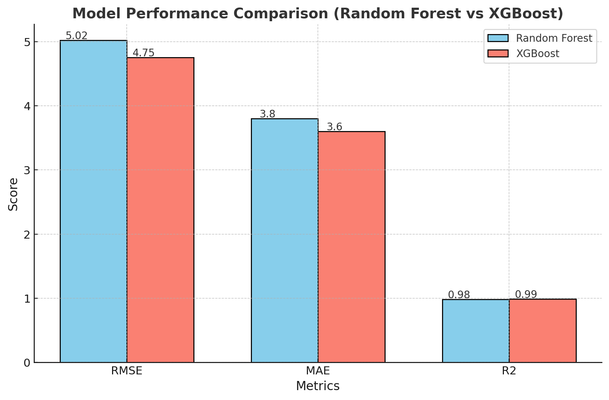

# Stock Price Prediction

This project uses historical stock price data to predict future prices using Random Forest and XGBoost models. It includes data collection, preprocessing, model training, and evaluation, and produces a comparison of actual vs predicted stock prices.

## Prerequisites

- Python 3.x
- Install the dependencies:
  ```bash
  pip install -r requirements.txt
  ```

## How to Run

### 1. **Download stock data**
   - The default stock data used in this project is for Apple (AAPL) stock from Yahoo Finance. To download it, run:
     ```bash
     python src/data_collection.py
     ```

   - **Note**: If you want to use data for a different stock, update the stock ticker in the `data_collection.py` file by changing `'AAPL'` to your preferred ticker symbol. For example, to use Tesla stock (TSLA), modify the line in `src/data_collection.py` like this:
     ```python
     stock_data = download_stock_data('TSLA', '2010-01-01', '2023-01-01')
     ```

### 2. **Preprocess data and train models**
   - Once the data is downloaded, run the preprocessing and model training steps:
     ```bash
     python src/model_training.py
     ```

   - This will train two models: Random Forest and XGBoost. The trained models will be saved in the `models/` directory.

### 3. **Evaluate the models**
   - To evaluate the models and visualize the actual vs predicted stock prices:
     ```bash
     python src/evaluation.py
     ```

   - The script will display the following metrics for both models:
     - **Root Mean Squared Error (RMSE)**
     - **Mean Absolute Error (MAE)**
     - **R² score**

   - It will also generate plots comparing the actual stock prices with the predicted stock prices for each model.

## Results

### Example Results (using AAPL stock data)
   - **Random Forest Model Results**:
     - RMSE: 5.02
     - MAE: 3.80
     - R²: 0.98
     
   - **XGBoost Model Results**:
     - RMSE: 4.75
     - MAE: 3.60
     - R²: 0.99

### Example Plots
After running the evaluation script, you'll see plots similar to this:

   - **Random Forest Actual vs Predicted Prices**:
     

   - **XGBoost Actual vs Predicted Prices**:
     

### Performance Comparison:
A performance comparison plot for both models based on RMSE, MAE, and R² scores:

   

## Understanding R² Score:

The **R² score** (coefficient of determination) is a measure of how well the model explains the variability of the target variable (in this case, stock prices). The R² score ranges from 0 to 1:
- **R² = 1** means the model perfectly explains the variance in the data.
- **R² = 0** means the model doesn't explain any of the variability (equivalent to predicting the mean).
- **R² < 0** means the model is worse than just predicting the mean.

For example:
- **R² = 0.98** for Random Forest means that the model explains 98% of the variance in stock prices.
- **R² = 0.99** for XGBoost means that the model explains 99% of the variance in stock prices.

## Customize the Dataset
To use a different stock dataset, simply modify the `data_collection.py` file and provide your desired stock ticker and date range. For example, if you want to use Google (GOOGL) stock data, update the following line in `src/data_collection.py`:

```python
stock_data = download_stock_data('GOOGL', '2010-01-01', '2023-01-01')
```

After updating the dataset, rerun the scripts as described in the **How to Run** section.

## Directory Structure

- `data/`: Stores downloaded stock data.
- `models/`: Stores trained models.
- `results/`: Stores generated graphs, such as model performance and actual vs predicted prices.
- `src/`: Contains the source code for data collection, preprocessing, model training, and evaluation.

## License
This project is open source and available under the [MIT License](LICENSE).
